# Sam Saffron
## co-founder Discourse

---

# Who is Sam?

---


##  co-founder Discourse
##  Huge Ruby fan
##  Huge fan of making Ruby fast
### [samsaffron.com](https://samsaffron.com)
### [@samsaffron](https://twitter.com/samsaffron)

---

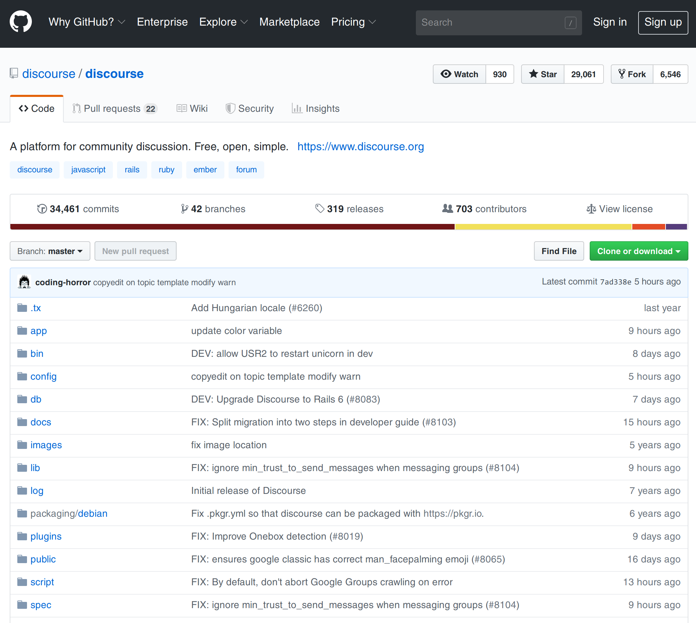

---


---


---

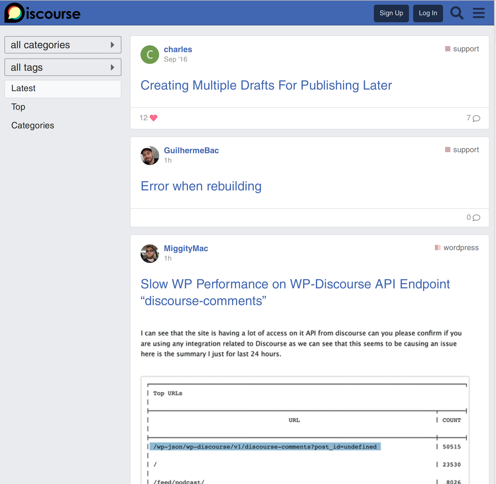

---

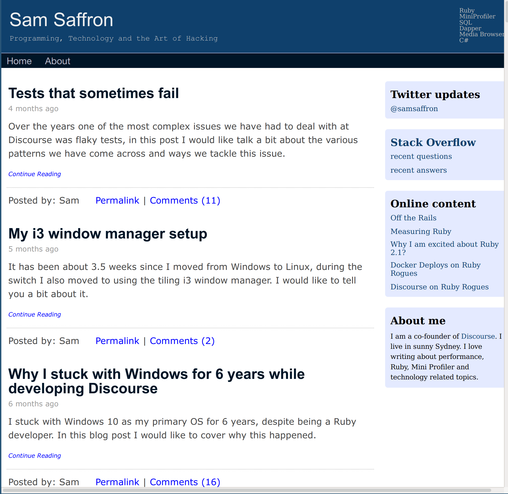

---

### How we work?

- 100% remote team
- Per geo dev teams + sysadmin team + community team
- Mattermost for ethereal discussion
- Discourse for long term memory

---

### About this talk

- Testing notes
- Building block, tips from Dev
- Deploying
- Monitoring
- Quick fix engineering

---

### Testing

- `bin/rake autospec`
- `bin/turbo_rspec`
- `fab!`

---

### message_bus

- Backed by Redis (PG optional)
- Server -> Server
- Server -> Client (long polling with chunked encoding)

```ruby
MessageBus.publish("/notifications", user_ids: [100])
MessageBus.subscribe("/notifications") do |n|
   ...
end
```

```javascript
MessageBus.subscribe("/notifications", (m) => {...});
```

---

### Powered by message_bus

```ruby
# shard aware, cross process
SiteSetting.title = "some title"

c = DistributedCache.new("Fragment")
c["bob"] = ["jane"]

# invalidates on entire cluster
c.delete("bob")

```

---

### mini_sql

```ruby
pg_conn = PG.connect(db_name: 'my_db')
conn = MiniSql::Connection.get(pg_conn)

puts conn.exec('update table set column = 1 where id in (1,2)')
# returns 2 if 2 rows changed

conn.query("select 1 id, 'bob' name").each do |user|
  puts user.name # bob
  puts user.id # 1
end

p conn.query_single('select 1 union select 2')
# [1,2]

p conn.query_hash('select 1 as a, 2 as b union select 3, 4')
# [{"a" => 1, "b"=> 1},{"a" => 3, "b" => 4}
```

---

### mini_sql

```ruby
builder = conn.build("select * from topics /*where*/ /*limit*/")

builder.where('created_at > ?', Time.now - 400)

if look_for_something
  builder.where("title = :title", title: 'something')
end

builder.limit(20)

builder.query.each do |t|
  puts t.id
  puts t.title
end
```

---

### mini_sql

```ruby

t = conn.query("select * from topics limit 1").first
# keep in mind ... t.title works!

# vs

Topic.first


# Comparison:
#        wide topic pg:     7474.0 i/s
#  wide topic mini sql:     7355.2 i/s - same-ish: difference falls within error
#    wide topic sequel:     5696.8 i/s - 1.31x  slower
#        wide topic ar:     2515.0 i/s - 2.97x  slower
```

---

### Defer queue

```ruby
def self.defer_track_visit(topic_id, ip, user_id, track_visit)
  Scheduler::Defer.later "Track Visit" do
    TopicViewItem.add(topic_id, ip, user_id)
    TopicUser.track_visit!(topic_id, user_id) if track_visit
  end
end
```

---

### Hijack

```ruby
def timings
  topic_id = params[:topic_id].to_i

  hijack do
    PostTiming.process_timings(
      ...
    )
    render body: nil
  end
end
```

---

### Anonymous Cache

- Why?
- Backed by Redis
- Also throttles
- Switch to anon mode when overloaded
- Opt-in

```
discourse_expires_in(1.minute)
```

---

### How we host?

- Early adopters of Docker
- App containers with Nginx/Unicorn/Sidekiq
- DB containers / Redis containers
- HAProxy (router + app server)
- ELK for logs
- Prometheus + Alert manager for monitoring
- jemalloc 3.6.0


---

### App container tricks

- Unicorn master forks Sidekiq workers
- Unicorn master monitors Sidekiq
- Drain requests on stop

```
./mothership deploy boingboing
```

---

### Containers and production testing

- Test Ruby upgrades in production, side-by-side
- Test Rails upgrades in production, side-by-side

---


### Monitoring

- prometheus_exporter gem / plugin (Why?)
- various exporters (haproxy, redis, cadvisor, pg, node)
- self hosted, metrics are cheap

---

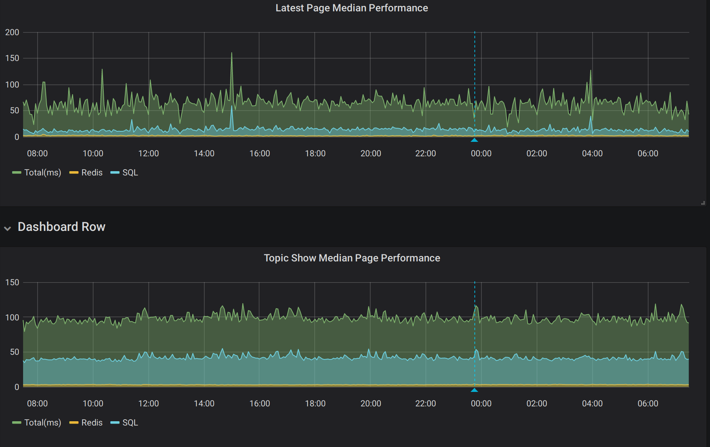

---

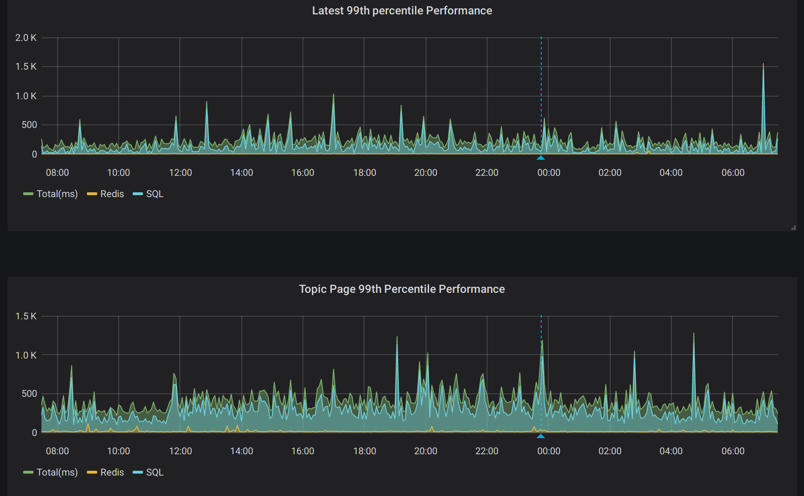

---

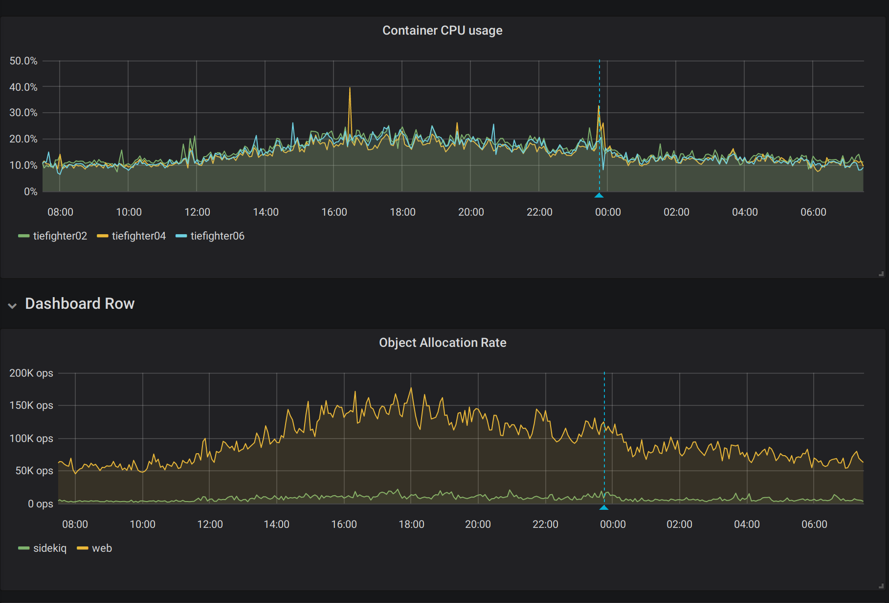

---

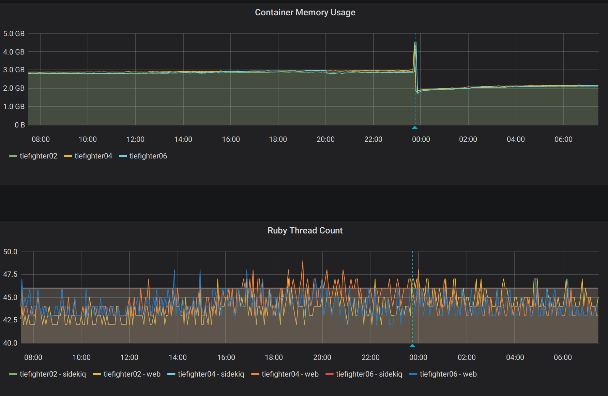

---

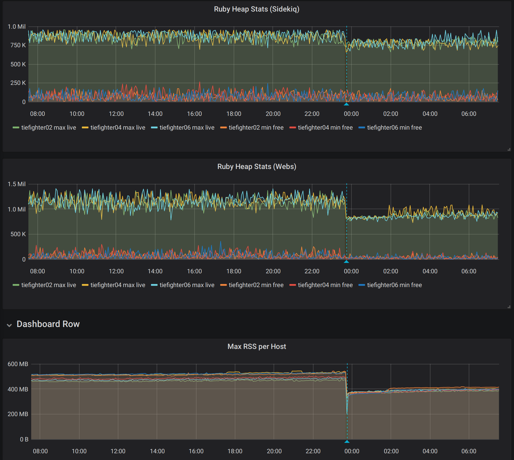

---

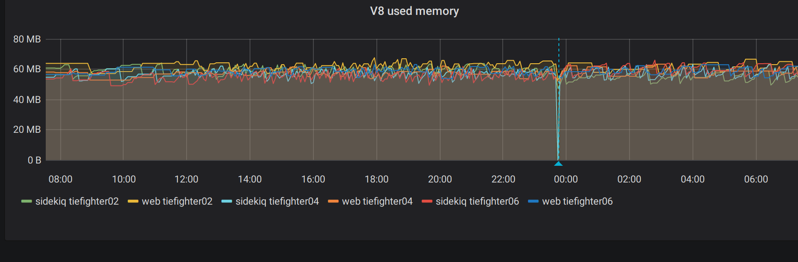


---

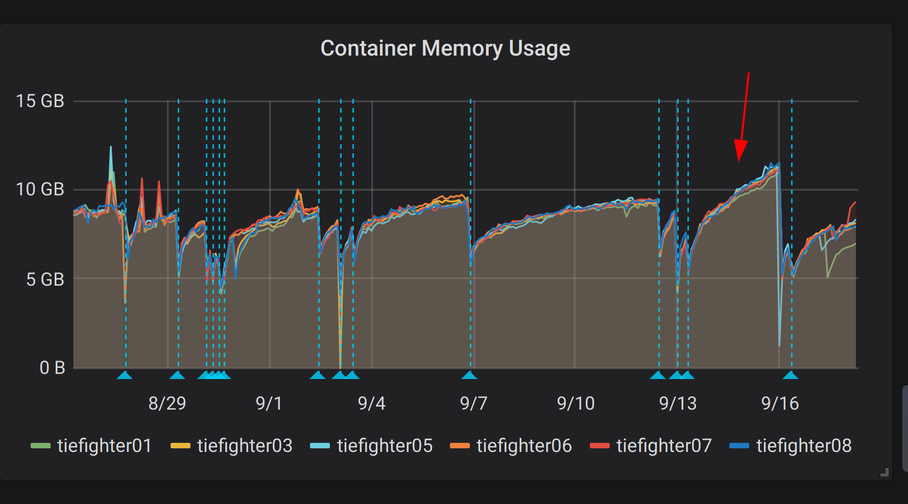

---

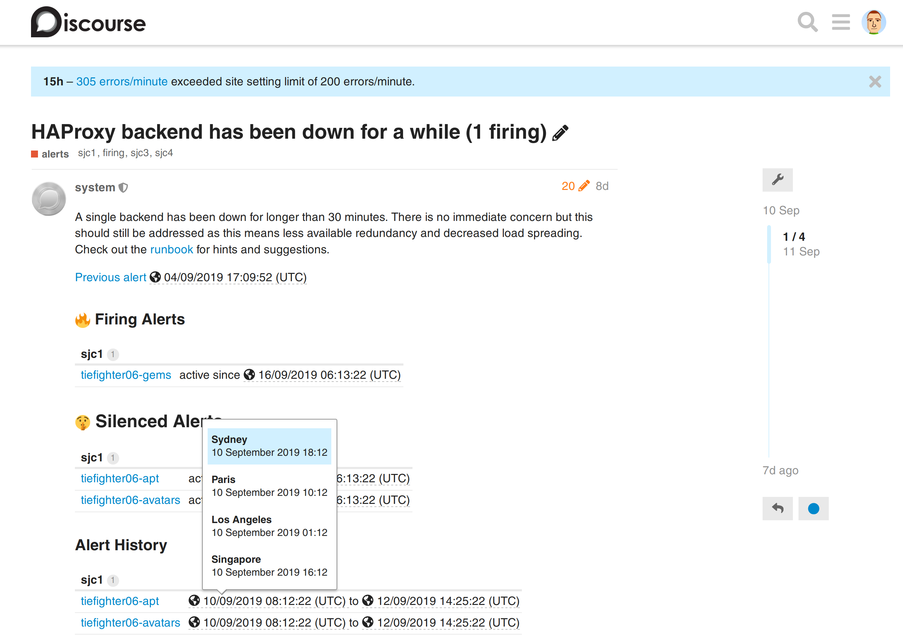

---


### Quick fix engineering

- rbtrace
- stackprof
- flamegraph
- memory_profiler
- rack_mini_profiler
- logster
- mwrap

---

### rbtrace - your swiss army knife

- Production safe
- Rogue CPU analysis
- Stuck process analysis
- Bloated process analysis

---

# `rbtrace -p PID --backtraces`

```
eval:1:in `backtrace'
bin/unicorn:63:in `fork'
...
/home/sam/.rbenv/versions/2.6.3/lib/ruby/gems/2.6.0/gems/hiredis-0.6.3/lib/hiredis/ext/connection.rb:19:in `read'
...
/home/sam/.rbenv/versions/2.6.3/lib/ruby/gems/2.6.0/gems/message_bus-2.2.2/lib/message_bus/timer_thread.rb:123:in `do_work'

lib/discourse.rb:669:in `sleep'"

```

---

# `rbtrace -p PID --memory`

```
count: 57
heap_allocated_pages: 2967
heap_sorted_length: 3093
heap_allocatable_pages: 126
heap_available_slots: 1209322
heap_live_slots: 1008034
heap_free_slots: 201288
heap_final_slots: 0
heap_marked_slots: 785879
heap_eden_pages: 2967
heap_tomb_pages: 0
total_allocated_pages: 2967
total_freed_pages: 0
total_allocated_objects: 3838897
total_freed_objects: 2830863
malloc_increase_bytes: 12653920
malloc_increase_bytes_limit: 33554432
minor_gc_count: 42
major_gc_count: 15
remembered_wb_unprotected_objects: 6882
remembered_wb_unprotected_objects_limit: 13616
old_objects: 768611
old_objects_limit: 1527406
oldmalloc_increase_bytes: 12653920
oldmalloc_increase_bytes_limit: 37811614

Object Stats

TOTAL: 1209322
T_STRING: 485064
FREE: 201137
...
T_COMPLEX: 1

```

---

### MWrap

- `/scripts/mwrap_sidekiq`


```
Generation: 2095 RSS kb: 940968 Accounted Mem kb: 278571
Allocated bytes: 145317426303 Freed bytes: 145032169313

...

total       | allocations | frees     | mean_life | max_life | location                                  
                                                                                                         
                                                                                                  
---------------------------------------------------------------------------------------------------------
---------------------------------------------------------------------------------------------------------
-----------------------------------------------------------------------------------------
545378045   | 1398989     | 1103097   | 0.38      | 2022     | /var/www/discourse/vendor/bundle/ruby/2.6.
0/gems/activesupport-6.0.0/lib/active_support/dependencies.rb:325                                        
                                                                                                  
120600932   | 964815      | 792335    | 0.26      | 57       | /var/www/discourse/vendor/bundle/ruby/2.6.
0/gems/activemodel-6.0.0/lib/active_model/attribute_methods.rb:381                                       
                                                                                                  
3582920     | 115463      | 2361      | 1.98      | 1515     | /var/www/discourse/vendor/bundle/ruby/2.6.
0/gems/activerecord-6.0.0/lib/active_record/connection_adapters/postgresql/database_statements.rb:98     
                                                                                                  
29548904    | 703483      | 646977    | 49.24     | 1931     | /var/www/discourse/vendor/bundle/ruby/2.6.
0/gems/activerecord-6.0.0/lib/active_record/connection_adapters/postgresql/oid/type_map_initializer.rb:84
                                                                                                  
179778178   | 401999      | 351104    | 0.27      | 37       | /var/www/discourse/vendor/bundle/ruby/2.6.
0/gems/actionview-6.0.0/lib/action_view/template.rb:341                                                  
                                                                                                  
101224404   | 1036941     | 1005049   | 11.98     | 1050     | /usr/local/lib/ruby/2.6.0/psych.rb:456    
                                                                                                         
                                                                                                  
17525368    | 395712      | 363924    | 49.24     | 1931     | /var/www/discourse/vendor/bundle/ruby/2.6.
0/gems/activerecord-6.0.0/lib/active_record/type/type_map.rb:26  

```

---
### Rack Mini Profiler

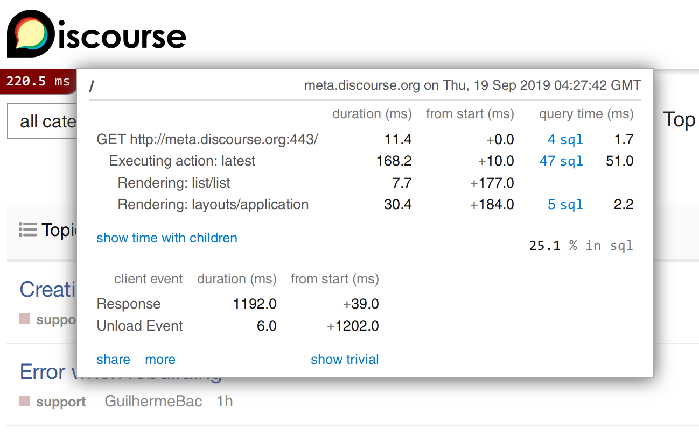

---

### Ruby / Rails wishlist

- Reduced memory usage

- Pre-JIT

- Faster Active Record

---

### How you can get involved?

- Contributions to diagnostic gems are welcome!

- Discourse is open source, some patterns can be extracted

- [rubybench.com](https://rubybench.com)

---

# Questions?
