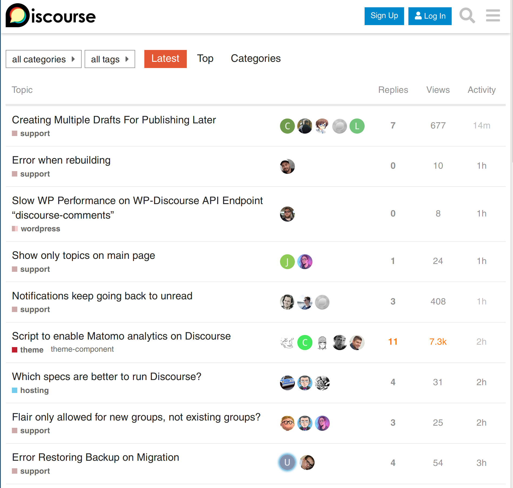

# Sam Saffron
## co-founder Discourse

---

# Who is Sam?

---


##  co-founder Discourse
##  Huge Ruby fan
##  Huge fan of making Ruby fast

---


---



---


---


---


---

### How we work?

- 100% remote team
- Per geo dev teams + sysadmin team + community team
- Mattermost for ethereal discussion
- Discourse for long term memory

---

### About this talk

- Building block, tips from Dev
- Deploying
- Monitoring
- Quick fix engineering

---

### Testing

- `bin/rake autospec`
- `bin/turbo_rspec`

---

### MessageBus

- Backed by Redis (PG optional)
- Server -> Server
- Server -> Client (long polling with chunked encoding)

```ruby
MessageBus.publish("/notifications", user_ids: [100])
MessageBus.subscribe("/notifications") do |n|
   ...
end
```

```javascript
MessageBus.subscribe("/notifications", (m) => {...});
```

---

### Defer queue

```ruby
def self.defer_track_visit(topic_id, ip, user_id, track_visit)
  Scheduler::Defer.later "Track Visit" do
    TopicViewItem.add(topic_id, ip, user_id)
    TopicUser.track_visit!(topic_id, user_id) if track_visit
  end
end
```

---

### Hijack

```ruby
def timings
  topic_id = params[:topic_id].to_i

  hijack do
    PostTiming.process_timings(
      ...
    )
    render body: nil
  end
end
```

---

### Anonymous Cache

- Why?
- Backed by Redis
- Also throttles
- Switch to anon mode when overloaded
- Opt-in

```
discourse_expires_in(1.minute)
```

---

### How we host?

- Early adopters of Docker
- App containers with Nginx/Unicorn/Sidekiq
- DB containers / Redis containers
- HAProxy (router + app server)
- ELK for logs
- Prometheus + Alert manager for monitoring
- jemalloc 3.6.0


---

### App container tricks

- Unicorn master forks Sidekiq workers
- Unicorn master monitors Sidekiq
- Drain requests on stop

```
./mothership deploy boingboing
```

---

### Containers and production testing

- Test Ruby upgrades in production, side-by-side
- Test Rails upgrades in production, side-by-side

---


### Monitoring

- prometheus_exporter gem / plugin (Why?)
- various exporter (haproxy, redis, cadvisor, pg, node)

---


---


---


---


---


---


---


---


---


### Quick fix engineering

- rbtrace
- stackprof
- flamegraph
- memory_profiler
- rack_mini_profiler
- mwrap

---

### rbtrace - your swiss army knife

- Production safe
- Rogue CPU analysis
- Stuck process analysis
- Bloated process analysis

---

# `rbtrace -p PID --backtraces`

```
eval:1:in `backtrace'
bin/unicorn:63:in `fork'
...
/home/sam/.rbenv/versions/2.6.3/lib/ruby/gems/2.6.0/gems/hiredis-0.6.3/lib/hiredis/ext/connection.rb:19:in `read'
...
/home/sam/.rbenv/versions/2.6.3/lib/ruby/gems/2.6.0/gems/message_bus-2.2.2/lib/message_bus/timer_thread.rb:123:in `do_work'

lib/discourse.rb:669:in `sleep'"

```

---

# `rbtrace -p PID --memory`

```
count: 57
heap_allocated_pages: 2967
heap_sorted_length: 3093
heap_allocatable_pages: 126
heap_available_slots: 1209322
heap_live_slots: 1008034
heap_free_slots: 201288
heap_final_slots: 0
heap_marked_slots: 785879
heap_eden_pages: 2967
heap_tomb_pages: 0
total_allocated_pages: 2967
total_freed_pages: 0
total_allocated_objects: 3838897
total_freed_objects: 2830863
malloc_increase_bytes: 12653920
malloc_increase_bytes_limit: 33554432
minor_gc_count: 42
major_gc_count: 15
remembered_wb_unprotected_objects: 6882
remembered_wb_unprotected_objects_limit: 13616
old_objects: 768611
old_objects_limit: 1527406
oldmalloc_increase_bytes: 12653920
oldmalloc_increase_bytes_limit: 37811614

Object Stats

TOTAL: 1209322
T_STRING: 485064
FREE: 201137
...
T_COMPLEX: 1

```

---
### Rack Mini Profiler


---

### Current pains

- Memory
- Slow/flakey test suite


---

### How you can help?

- All diagnostic gems are open source

